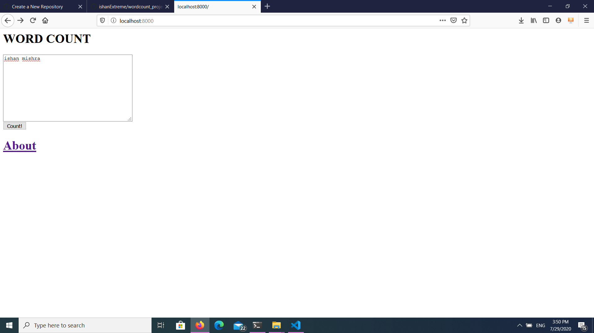
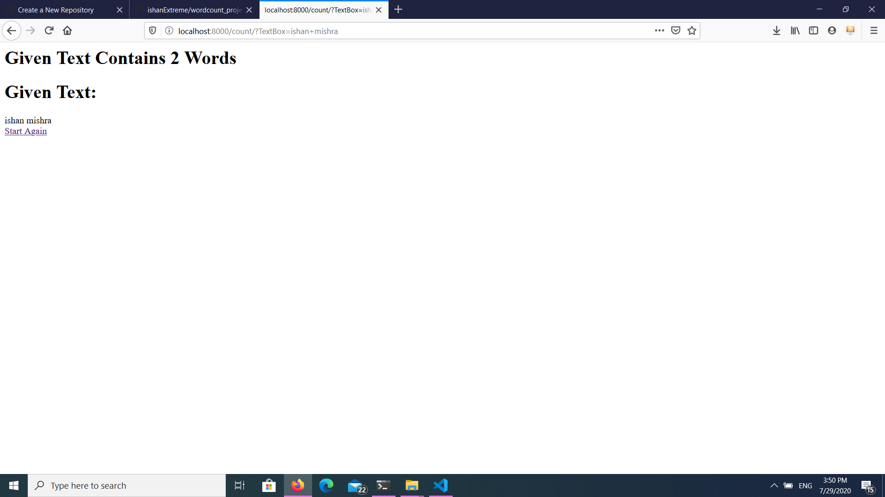

# Word_Counts
Count number of words in the given string(Django starter project)

# Tools/Languages Used
  
  * Django framework(Python based) is used as a backend <a href='#'>See Tutorial Here</a>
  * HTML/CSS, JavaScript <a href='#'>See Tutorial Here</a>
  
# About the Project
  
  Simple Django project which counts the number of words in a given string. Aim of this project is to get started with django
  
# Images

  
# Prerequisites
  * Django for backend
  * Basic CSS/HTML for frontend
  * Python
  
# What you will learn after completing this project?
  * Getting started with django
 

  
  

  

